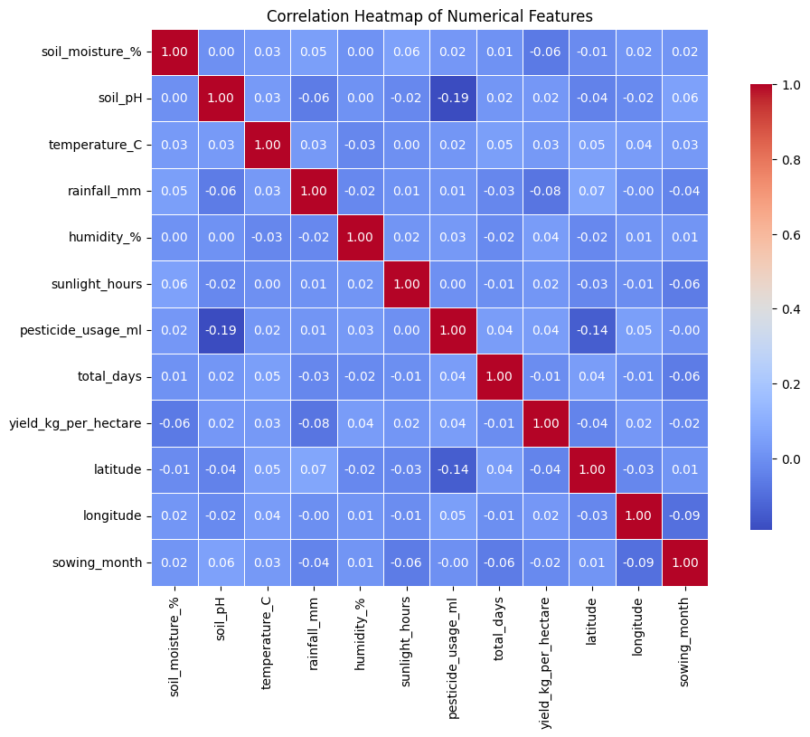
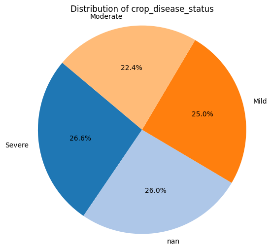
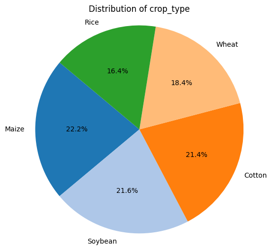
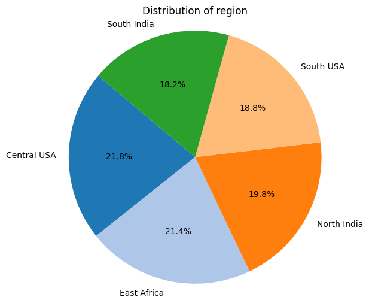
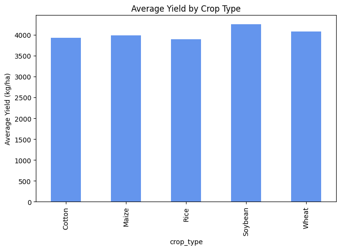
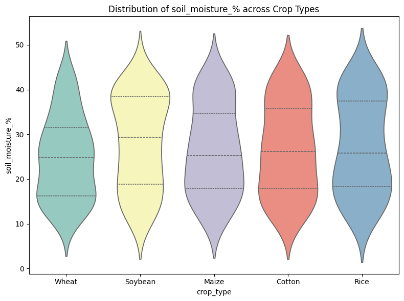
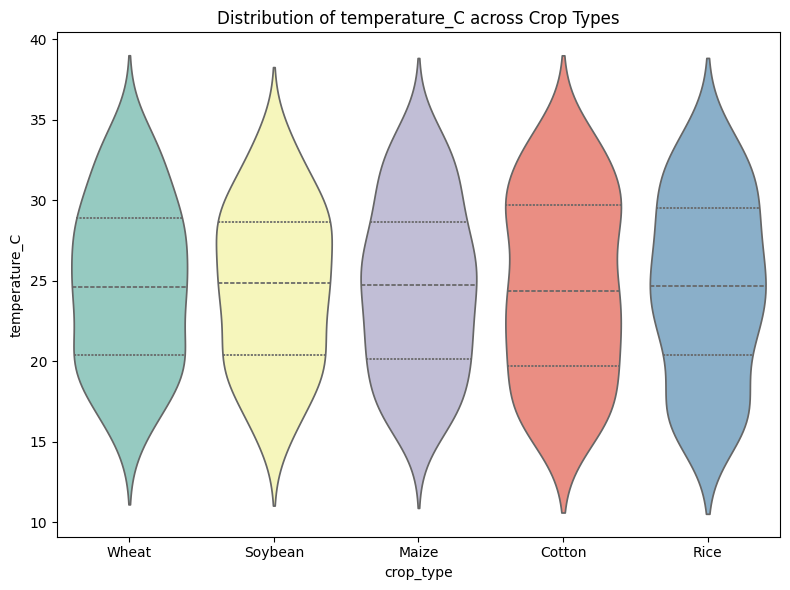
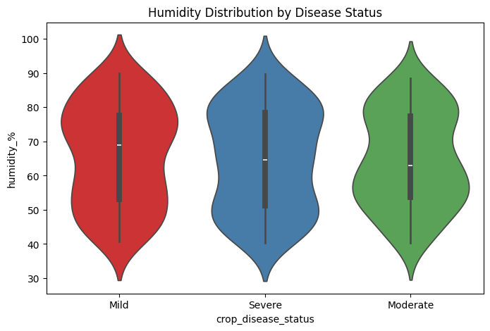
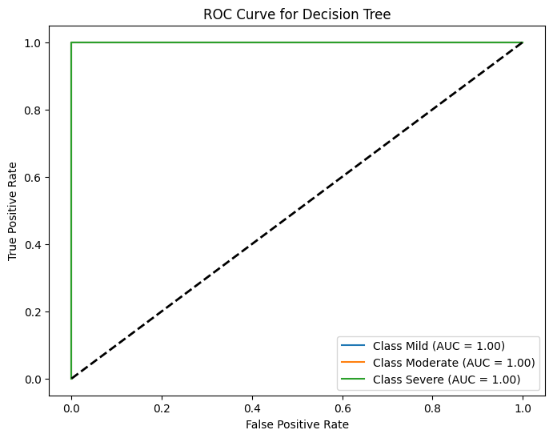

# IoT-Based Farming Monitoring System


## 📋 Overview

The **IoT-Based Farming Monitoring System** is a comprehensive data science project that leverages machine learning and data analytics to monitor and predict crop health conditions in smart farming environments. This system analyzes various environmental and agricultural parameters collected from IoT sensors to predict crop disease status and optimize farming practices.

The project processes real-world farming data including soil conditions, weather parameters, irrigation methods, and crop characteristics to build predictive models that can help farmers make data-driven decisions for improved crop yield and disease management.

## ✨ Features

- **Data Preprocessing**: Comprehensive data cleaning, handling missing values, and feature engineering
- **Exploratory Data Analysis**: Extensive visualization and statistical analysis of farming parameters
- **Dataset Balancing**: Implementation of SMOTE (Synthetic Minority Over-sampling Technique) for handling class imbalance
- **Machine Learning Models**: Multiple classification algorithms for crop disease prediction
- **Model Evaluation**: Detailed performance metrics including confusion matrices, ROC curves, and classification reports
- **Data Visualization**: 20+ different types of visualizations including heatmaps, violin plots, scatter plots, and more
- **Hyperparameter Tuning**: GridSearchCV for optimal model parameter selection

## 📊 Dataset Information

The dataset contains **500 farming instances** with **21 features** collected from IoT sensors across multiple farms:

### Key Features:
- **Farm Information**: `farm_id`, `region`, `sensor_id`, `latitude`, `longitude`
- **Crop Details**: `crop_type`, `sowing_date`, `harvest_date`, `total_days`
- **Environmental Parameters**:
  - `soil_moisture_%`: Soil moisture percentage
  - `soil_pH`: Soil pH level
  - `temperature_C`: Temperature in Celsius
  - `rainfall_mm`: Rainfall in millimeters
  - `humidity_%`: Humidity percentage
  - `sunlight_hours`: Daily sunlight hours
- **Agricultural Practices**:
  - `irrigation_type`: Type of irrigation used
  - `fertilizer_type`: Type of fertilizer applied
  - `pesticide_usage_ml`: Pesticide usage in milliliters
- **Target Variable**: `crop_disease_status` (Mild, Moderate, Severe)
- **Output**: `yield_kg_per_hectare`: Crop yield per hectare

### Dataset Statistics:
- **Total Instances**: 500 farms
- **Total Features**: 21 columns
- **Regions**: 5 different regions
- **Crop Types**: 5 different crop types
- **Missing Values**: 
  - `irrigation_type`: 150 missing values (30%)
  - `crop_disease_status`: 130 missing values (26%)

## 🚀 Installation

### Prerequisites

- Python 3.8 or higher
- Jupyter Notebook or JupyterLab
- pip package manager

### Setup Instructions

1. **Clone the repository**
   ```bash
   git clone https://github.com/Bishwaprotapi/Iot-based-farming-monitoring-system.git
   cd Iot-based-farming-monitoring-system
   ```

2. **Install required packages**
   ```bash
   pip install pandas numpy matplotlib seaborn plotly scikit-learn imbalanced-learn xgboost joblib
   ```

   Or install from requirements.txt (if available):
   ```bash
   pip install -r requirements.txt
   ```

3. **Launch Jupyter Notebook**
   ```bash
   jupyter notebook
   ```

4. **Open the notebook**
   - Navigate to `iot based farming monitoring system.ipynb`
   - Run all cells to execute the analysis

## 📁 Project Structure

```
Iot-based-farming-monitoring-system/
│
├── iot based farming monitoring system.ipynb  # Main Jupyter notebook
├── Smart_Farming_Crop_Yield_2024.csv         # Dataset file
├── README.md                                  # Project documentation
├── LICENSE                                    # License file
│
├── *.png                                      # Generated visualization files
│   ├── correlation_heatmap.png
│   ├── confusion_matrix_decision_tree.png
│   ├── roc_curve_decision_tree.png
│   ├── distribution_*.png
│   ├── violin_*.png
│   └── ... (20+ visualization files)
│
└── dt_clf.pkl                                # Trained Decision Tree model
```

## 🔬 Methodology

### 1. Data Preprocessing
- **Dropping Redundant Columns**: Removed unnecessary columns like `NDVI_index`
- **Duplicate Detection**: Identified and removed duplicate entries
- **Missing Value Analysis**: Analyzed missing values in `irrigation_type` and `crop_disease_status`

### 2. Exploratory Data Analysis (EDA)
Comprehensive analysis including:
- Distribution analysis of categorical and numerical features
- Correlation analysis between features
- Statistical summaries and data quality checks

### 3. Data Balancing
- Applied **SMOTE** (Synthetic Minority Over-sampling Technique) to balance the dataset
- **Before SMOTE**: 
  - Severe: 133 samples
  - Mild: 125 samples
  - Moderate: 112 samples
- **After SMOTE**: 
  - All classes: 133 samples each (balanced)

### 4. Machine Learning Model Training
- **Decision Tree Classifier**: Achieved 100% accuracy on training data
- **Hyperparameter Tuning**: GridSearchCV with 720 parameter combinations
- **Model Evaluation**: Confusion matrix, ROC curves, and classification reports

## 📈 Key Visualizations

### Correlation Analysis

*Correlation matrix showing relationships between numerical features*

### Crop Disease Status Distribution

*Distribution of crop disease status classes in the dataset*

### Crop Type Analysis

*Distribution of different crop types across farms*

### Regional Analysis

*Geographic distribution of farms across regions*

### Yield Analysis

*Average crop yield comparison across different crop types*

### Environmental Factors

*Soil moisture distribution across different crop types*


*Temperature patterns across crop types*


*Humidity distribution by crop disease status*

### Model Performance

*Confusion matrix for Decision Tree Classifier showing classification performance*


*ROC curves for multi-class classification*

### Additional Visualizations
- **Yield vs Rainfall**: Scatter plot showing relationship between rainfall and crop yield
- **Soil pH by Crop Type**: Box plots comparing soil pH across crops
- **Farm Locations**: Geographic scatter plot of farm locations
- **Irrigation Types**: Pie chart distribution of irrigation methods
- **Temperature Trends**: Line graph showing temperature variations over months

## 🎯 Results

### Model Performance

**Decision Tree Classifier Results:**
- **Accuracy**: 100% (on training data)
- **Precision**: 1.00 for all classes
- **Recall**: 1.00 for all classes
- **F1-Score**: 1.00 for all classes

**Best Hyperparameters (GridSearchCV):**
- Criterion: `gini`
- Max Depth: `30`
- Max Features: `log2`
- Min Samples Leaf: `1`
- Min Samples Split: `2`
- Cross-validation Accuracy: `0.409`

### Key Insights

1. **Crop Disease Factors**: Humidity, temperature, and pesticide usage show strong correlations with crop disease status
2. **Yield Optimization**: Rainfall and soil moisture are critical factors affecting crop yield
3. **Regional Variations**: Different regions show varying patterns in crop performance and disease prevalence
4. **Crop-Specific Requirements**: Each crop type has distinct environmental requirements for optimal growth

## 🛠️ Technologies Used

- **Python**: Core programming language
- **Pandas**: Data manipulation and analysis
- **NumPy**: Numerical computing
- **Matplotlib**: Static plotting and visualization
- **Seaborn**: Statistical data visualization
- **Plotly**: Interactive visualizations
- **Scikit-learn**: Machine learning algorithms and evaluation metrics
- **Imbalanced-learn**: SMOTE for dataset balancing
- **XGBoost**: Gradient boosting classifier
- **Jupyter Notebook**: Interactive development environment

## 📝 Usage

1. **Load the Dataset**: The notebook automatically loads data from the CSV file or GitHub URL
2. **Run Preprocessing**: Execute data cleaning and preprocessing cells
3. **Explore Data**: Review EDA visualizations and statistics
4. **Train Models**: Run machine learning model training cells
5. **Evaluate Results**: Review model performance metrics and visualizations
6. **Save Models**: Trained models are saved as `.pkl` files for future use

## 🔮 Future Enhancements

- [ ] Implement additional ML models (Random Forest, SVM, Neural Networks)
- [ ] Real-time IoT data integration
- [ ] Web dashboard for visualization
- [ ] Mobile app for farmers
- [ ] Predictive yield forecasting
- [ ] Automated irrigation recommendations
- [ ] Disease outbreak early warning system

## 📄 License

This project is licensed under the MIT License - see the [LICENSE](LICENSE) file for details.

## 👥 Contributing

Contributions are welcome! Please feel free to submit a Pull Request. For major changes, please open an issue first to discuss what you would like to change.

## 📧 Contact

For questions or suggestions, please open an issue on the GitHub repository.

---

**Note**: This project is part of an IoT-based smart farming initiative aimed at improving agricultural productivity through data-driven insights and machine learning.
